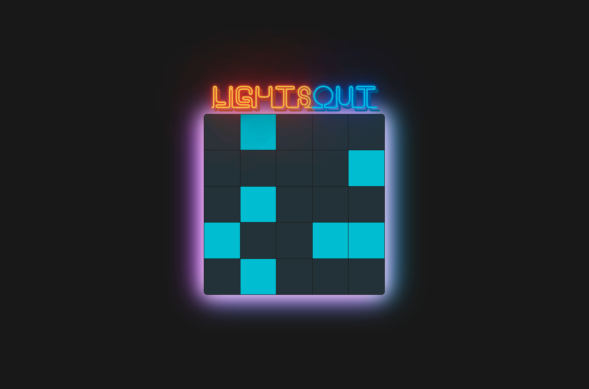

# Lights Out

This project was made based on starter code from Colt Steele's Udemy course [The Modern React Bootcamp](https://www.udemy.com/course/modern-react-bootcamp/). The animated neon sign font came from a [Codepen](https://codepen.io/Trinca/pen/NrvpWa) by Thomas Trinca.

Players click on tiles to flip them "on" or "off". Clicking one tile will also flip its adjacent tiles. The goal of the game is to flip all of the tiles on the board to "off". 

## Future Development

While the functionality of the game is complete, I would like to add a check to ensure that each starting board state is winnable. That's not currently a guarantee, which could lead to a frustrating experience for unlucky players!

## Run the App

`npm start`

Runs the app in the development mode.\
Open [http://localhost:3000](http://localhost:3000) to view it in your browser.